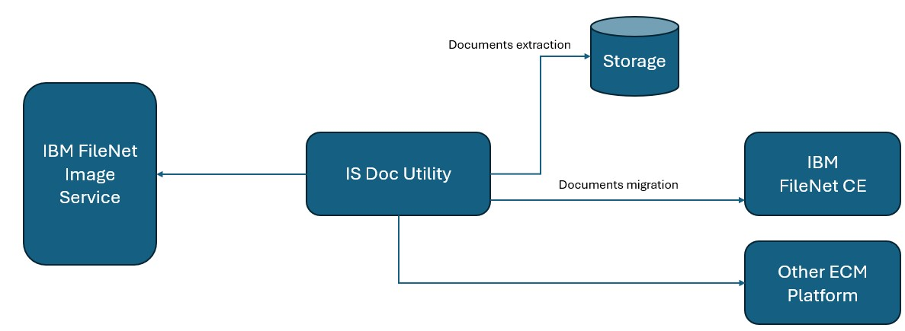

# ibm-filenet-image-service-isra-tool
leverage ibm filenet image service isra adapter to interact with image service to perform documents creation, extraction ,query and migration to other modern ecm platforms

